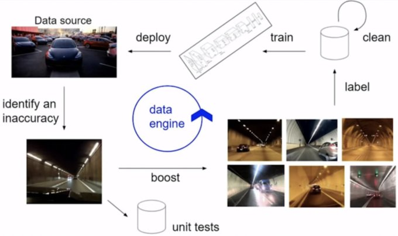

Should the terminal's model only affect the current editor context?
- No. Ideally the user should just be able to enter a stream of thought and the model will then visualize it using components.

It would be best to split the process over a few layers:
User types in terminal -> text mapped to executable commands -> visual representation updated + saved

The visual representation layer is already complete and can be expanded as needed. The next steps should be:
1. Develop the executable commands + interpreter
2. Train the model to go from natural language to executable commands
3. Add the model to the front end (should run in terminal)

Methods to get the data:
- Generate random series of commands with garbage data -> Write the project description
- Write the project description -> Create the project in the mapper website -> Save the corresponding commands that were executed
- Start by setting up data engine (https://twitter.com/karpathy/status/1599852921541128194):

1. User enters description in terminal
2. Mapper performs estimated actions
3. User makes needed changes
4. Capture collected data
5. Perform any needed cleaning
6. Feed cleaned data into training task
7. Retrain model
8. Deploy new model

Your project sounds interesting! To achieve the mapping of user-entered sentences to commands, you can follow these general steps:

    Data Collection and Labeling:
        Collect a dataset of user-entered sentences along with the corresponding desired commands. Ensure that your dataset covers a diverse range of inputs to make your model robust.
        Label each sentence with the corresponding command or action it should trigger.

    Data Preprocessing:
        Tokenize and clean the text data. Remove unnecessary punctuation, convert text to lowercase, and handle any specific preprocessing based on your dataset.

    Choose a Model Architecture:
        Decide on a suitable model architecture for your task. Depending on the complexity of your mapping, you might use traditional machine learning algorithms (such as SVMs or decision trees) or more advanced methods like recurrent neural networks (RNNs) or transformer models.

    Feature Representation:
        Convert the tokenized text into a suitable representation for your chosen model. This could involve techniques like word embeddings (Word2Vec, GloVe) or using pre-trained language models like BERT or GPT.

    Training the Model:
        Split your dataset into training and testing sets. Train your model on the training set and evaluate its performance on the testing set.
        Fine-tune the model based on the evaluation results to improve its accuracy.

    Integration with Commands:
        Once your model is trained and performing well, integrate it into your system to map user-entered sentences to commands. Ensure that the output is in a format that can be easily executed by your system.

    User Interface:
        Design a user interface or interaction system where users can input sentences, and the corresponding commands are generated and executed.

    Error Handling:
        Implement robust error handling and feedback mechanisms in case the model encounters ambiguous or unknown inputs.

    Security Considerations:
        Be cautious about potential security risks associated with executing commands based on user inputs. Implement proper validation and sanitation to prevent unintended consequences.

    Testing and Validation:

    Thoroughly test your system with a variety of inputs to ensure its robustness and reliability. Validate the outputs against expected results.

Remember to iterate on your model and system based on user feedback and real-world usage to continuously improve its performance.